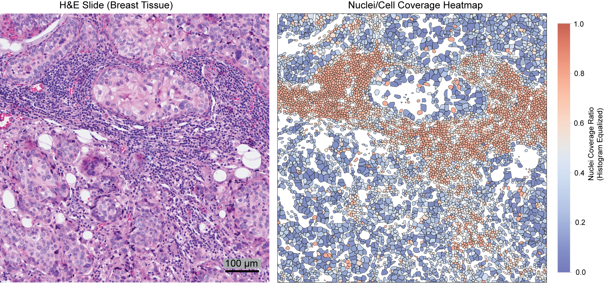

# VitaminP: Cross-Modal Cell & Nuclei Segmentation for Computational Pathology

<div align="center">

[](https://pypi.org/project/vitaminp/)
[](https://ghcr.io/idso-fa1-pathology/vitaminp)
[](https://www.python.org/downloads/)
[](https://pytorch.org/)
[](LICENSE)

**Whole-cell segmentation from H&E — no immunofluorescence required at inference.**

[📄 Paper](#citation) • [🐛 Issues](https://github.com/idso-fa1-pathology/vitamin-p/issues) • [🐳 Docker](#-docker) • [📦 PyPI](https://pypi.org/project/vitaminp/)

</div>

---



---

## Overview

**VitaminP** is a DINOv2-based segmentation framework that learns cytoplasmic boundaries from paired H&E–MIF training data, enabling **whole-cell segmentation directly from routine H&E slides** — without requiring immunofluorescence at inference time.

Trained on **14 public datasets · 34 cancer types · 7M+ annotated instances**.

---

## Installation

**pip** (Python API):
```bash
pip install vitaminp
```

**Docker** (recommended for servers/HPC — includes CUDA 12.1 + pretrained weights):
```bash
docker pull ghcr.io/idso-fa1-pathology/vitaminp:latest
```

> ⚠️ NumPy/OpenCV conflict? Run: `pip install "numpy<2" --force-reinstall`

---

## Models

| Model | Input | Use case | Size |
|-------|-------|----------|------|
| `flex` | H&E **or** MIF | General purpose — start here | large |
| `dual` | H&E **+** MIF (paired) | Maximum accuracy with both modalities | base |
| `syn` | H&E only | Whole-cell when no MIF available | base |

**Available branches:**

| Branch | Description |
|--------|-------------|
| `he_nuclei` | H&E nuclei segmentation |
| `he_cell` | H&E whole-cell segmentation |
| `mif_nuclei` | MIF nuclei segmentation |
| `mif_cell` | MIF whole-cell segmentation |

> 💡 **Tip:** Running `he_nuclei` + `he_cell` together activates joint inference — nuclei predictions constrain cell boundaries for better accuracy.

---

## Quick Start

```python
import vitaminp

# Load pretrained model — downloads once, cached forever
model = vitaminp.load_model('flex', device='cuda')

# See all available models
vitaminp.available_models()
```

---

## Python API

### H&E Segmentation (most common)

```python
import vitaminp
from vitaminp.inference import WSIPredictor

model = vitaminp.load_model('flex', device='cuda')

predictor = WSIPredictor(
    model=model,
    device='cuda',
    patch_size=512,
    overlap=64,
    target_mpp=0.4250,   # microns per pixel
    magnification=20,
    batch_size=32,        # lower to 4–8 if out of GPU memory
    tissue_dilation=1,
)

results = predictor.predict(
    wsi_path='slide.svs',
    output_dir='results/',
    branches=['he_nuclei', 'he_cell'],
    filter_tissue=True,
    tissue_threshold=0.10,
    clean_overlaps=True,
    save_geojson=True,    # QuPath-compatible output
    min_area_um=10.0,
)

print(f"Nuclei: {results['he_nuclei']['num_detections']}")
print(f"Cells:  {results['he_cell']['num_detections']}")
```

### MIF Segmentation

```python
import vitaminp
from vitaminp.inference import WSIPredictor
from vitaminp.inference.channel_config import ChannelConfig

model = vitaminp.load_model('flex', device='cuda')

# Define which channels correspond to nucleus and membrane
config = ChannelConfig(
    nuclear_channel=2,           # e.g. DAPI
    membrane_channel=[0, 1],     # e.g. cell markers
    membrane_combination='max',
    channel_names={0: 'CellMarker1', 1: 'CellMarker2', 2: 'DAPI'}
)

predictor = WSIPredictor(
    model=model,
    device='cuda',
    patch_size=512,
    overlap=64,
    target_mpp=0.4250,
    magnification=20,
    mif_channel_config=config,   # required for MIF input
    batch_size=16,
)

results = predictor.predict(
    wsi_path='mif_image.tif',
    output_dir='results/',
    branches=['mif_nuclei', 'mif_cell'],
    filter_tissue=True,
    clean_overlaps=True,
    save_geojson=True,
    detection_threshold=0.2,
    min_area_um=5.0,
)

print(f"MIF Nuclei: {results['mif_nuclei']['num_detections']}")
print(f"MIF Cells:  {results['mif_cell']['num_detections']}")
```

### Dual Model — Paired H&E + MIF

```python
import vitaminp
from vitaminp.inference import WSIPredictor
from vitaminp.inference.channel_config import ChannelConfig

model = vitaminp.load_model('dual', device='cuda')

config = ChannelConfig(
    nuclear_channel=2,
    membrane_channel=[0, 1],
    membrane_combination='max',
    channel_names={0: 'CellMarker1', 1: 'CellMarker2', 2: 'DAPI'}
)

predictor = WSIPredictor(
    model=model,
    device='cuda',
    patch_size=512,
    overlap=64,
    target_mpp=0.4250,
    magnification=20,
    mif_channel_config=config,
    batch_size=4,
)

results = predictor.predict(
    wsi_path='he_image.png',
    wsi_path_mif='mif_image.png',   # co-registered MIF
    output_dir='results/',
    branches=['he_nuclei', 'he_cell', 'mif_nuclei', 'mif_cell'],
    filter_tissue=True,
    clean_overlaps=True,
    save_geojson=True,
    min_area_um=5.0,
)

print(f"H&E nuclei:  {results['he_nuclei']['num_detections']}")
print(f"H&E cells:   {results['he_cell']['num_detections']}")
print(f"MIF nuclei:  {results['mif_nuclei']['num_detections']}")
print(f"MIF cells:   {results['mif_cell']['num_detections']}")
```

---

## 🐳 Docker

The Docker image has CUDA 12.1, all dependencies, and pretrained weights pre-installed at `/workspace/checkpoints/`. No setup needed.

### H&E inference
```bash
docker run --gpus all --rm \
  -v /your/images:/data \
  -v /your/results:/results \
  ghcr.io/idso-fa1-pathology/vitaminp:latest \
  python3 /workspace/scripts/run_wsi_inference.py \
    --model_type flex \
    --model_size large \
    --checkpoint /workspace/checkpoints/vitamin_p_flex.pth \
    --wsi_path /data/slide.svs \
    --output_dir /results \
    --branches he_nuclei he_cell \
    --target_mpp 0.4250 \
    --magnification 20 \
    --batch_size 32 \
    --filter_tissue \
    --save_geojson \
    --min_area_um 10.0
```

### Batch folder inference
```bash
docker run --gpus all --rm \
  -v /your/images:/data \
  -v /your/results:/results \
  ghcr.io/idso-fa1-pathology/vitaminp:latest \
  python3 /workspace/scripts/run_wsi_inference.py \
    --model_type flex \
    --model_size large \
    --checkpoint /workspace/checkpoints/vitamin_p_flex.pth \
    --wsi_folder /data \
    --wsi_extension svs \
    --output_dir /results \
    --branches he_nuclei he_cell \
    --target_mpp 0.4250 \
    --magnification 20 \
    --batch_size 32 \
    --filter_tissue \
    --save_geojson \
    --min_area_um 10.0
```

### MIF inference
```bash
docker run --gpus all --rm \
  -v /your/images:/data \
  -v /your/results:/results \
  ghcr.io/idso-fa1-pathology/vitaminp:latest \
  python3 /workspace/scripts/run_wsi_inference.py \
    --model_type flex \
    --model_size large \
    --checkpoint /workspace/checkpoints/vitamin_p_flex.pth \
    --wsi_path /data/mif_image.tif \
    --output_dir /results \
    --branches mif_nuclei mif_cell \
    --mif_nuclear_channel 2 \
    --mif_membrane_channels 0,1 \
    --target_mpp 0.4250 \
    --magnification 20 \
    --batch_size 16 \
    --filter_tissue \
    --save_geojson \
    --min_area_um 5.0
```

### Key CLI arguments

| Argument | Description |
|----------|-------------|
| `--model_type` | `flex` or `dual` |
| `--model_size` | `base` or `large` |
| `--checkpoint` | Path to `.pth` weights file |
| `--wsi_path` | Single image |
| `--wsi_folder` | Folder of images (use with `--wsi_extension`) |
| `--branches` | Space-separated: `he_nuclei he_cell mif_nuclei mif_cell` |
| `--target_mpp` | Microns per pixel (default: `0.25`) |
| `--magnification` | `20` or `40` |
| `--batch_size` | Lower if CUDA out of memory |
| `--mif_nuclear_channel` | Channel index for nucleus (MIF only) |
| `--mif_membrane_channels` | Comma-separated channel indices, e.g. `0,1` |
| `--detection_threshold` | `0.5`–`0.8` (higher = fewer false positives) |
| `--min_area_um` | Minimum object area in μm² |
| `--save_geojson` | QuPath-compatible output |
| `--save_parquet` | Fast binary format |
| `--save_visualization` | PNG overlay images |

---

## Output Files

```
results/
├── he_nuclei_detections.geojson     # QuPath-compatible nuclei annotations
├── he_cell_detections.geojson       # QuPath-compatible cell annotations
├── mif_nuclei_detections.geojson    # (if MIF branches used)
├── mif_cell_detections.geojson
├── he_nuclei_boundaries.png         # Visualization overlay
└── inference.log                    # Full run log
```

GeoJSON output loads directly into [QuPath](https://qupath.github.io/) for interactive review.

---

## Troubleshooting

| Problem | Fix |
|---------|-----|
| CUDA out of memory | Lower `batch_size` to 4–8 |
| No MPP metadata in image | Add `mpp_override=0.4250` (Python) or `--wsi_properties '{"slide_mpp":0.4250}'` (Docker) |
| Too many false positives | Increase `detection_threshold=0.7` and `min_area_um=10.0` |
| NumPy / OpenCV error | `pip install "numpy<2" --force-reinstall` |
| Wrong MIF channels | Set `mif_channel_config` (Python) or `--mif_nuclear_channel` + `--mif_membrane_channels` (Docker) |
| Stale file handle on HPC | Use `--output_dir /tmp/results` then copy out after inference |
| No internet for backbone | Mount cache: `-v ~/.cache/huggingface:/root/.cache/huggingface` |

---

## Citation

If you use VitaminP in your research, please cite:

```bibtex
@article{shokrollahi2025vitaminp,
  title   = {Vitamin-P: vision transformer assisted multi-modality integration
             network for pathology cell segmentation},
  author  = {Shokrollahi, Yasin and Pinao Gonzales, Karina and Barrientos Toro, Elizve
             and Acosta, Paul and Chen, Pingjun and Yuan, Yinyin and Pan, Xiaoxi},
  journal = {Nature Methods},
  year    = {2025}
}
```

---

## License

MIT License — see [LICENSE](LICENSE).

---

<div align="center">
Made with ❤️ at <b>MD Anderson Cancer Center</b><br>
Department of Translational Molecular Pathology · Institute for Data Science in Oncology
</div>
